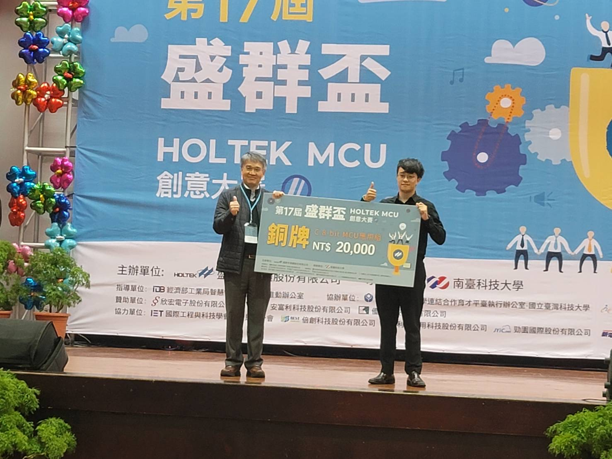
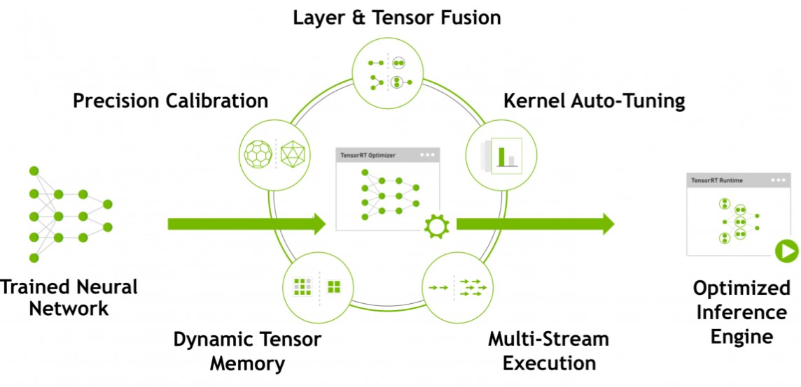

# Tennis Ball Machine

運用影像追蹤技術來追蹤人，透過Jetson Nano(4G)邊緣運算裝置讀取攝影機影像，輸入到物件追蹤演算法的神經網路內進行運算，標示出影像中球員
並轉換為座標進行運算判斷球員在影像中的位置，使用UART通訊介面傳送判斷後的資料至網球機控制平台(HT66F2390)，控制發球、上下抬升以及旋轉
底盤的各馬達，根據球員的位置改變發球方向

## Awarded

###  **第十七屆盛群盃HOLTEK MCU創意大賽  C組8-Bit MCU應用組 銅牌**

## Schedule

### [第十七屆盛群盃HOLTEK MCU 創意大賽](https://mcu.holtek.com.tw/mcugame17/index.aspx)

- 初賽報告交件時間: 5/31 --- 已繳交
- 初賽審核: 6/1~6/14 
- 入選公佈: 6/15 --- 通過
- 元件寄送: 7/1 --- 收到
- 複賽報告上傳: 11/16 前
- 作品照片&決賽海報上傳: 11/20 前
- 作品影片上傳: 12/2 前
- 決賽: 12/24(六)

-----------------------

# Hardware

Driver 1 for shut

| Pin Name | 2390 Pin |
|:--------:|:--------:|
|   ENA    |   PC6    |
|   IN1    |   PG0    |
|   IN2    |   PG1    |
|   ENB    |   PD0    |
|   IN3    |   PG2    |
|   IN4    |   PG3    |

Driver 2 for Rotate and Raise
Port A => Raise
prot B => Rotate

| Pin Name | 2390 Pin |
|:--------:|:--------:|
|   ENA    |   XXX    |
|   IN1    |   PG4    |
|   IN2    |   PG5    |
|   ENB    |   PF7    |
|   IN3    |   PG6    |
|   IN4    |   PG7    |

### Install OpenCV

https://chtseng.wordpress.com/2019/05/01/nvida-jetson-nano-初體驗：安裝與測試/

[Install OpenCV 4.5 on Jetson Nano](https://qengineering.eu/install-opencv-4.5-on-jetson-nano.html)

### VNC Setup

794 202 103
8bz33e7a

[Jetson Nano 遠端桌面設定](https://blog.cavedu.com/2019/12/19/jetson-nano-remote-desktop-windows-mac-osx/)

### Install tensorflow

[Installing TensorFlow for Jetson Platform](https://docs.nvidia.com/deeplearning/frameworks/install-tf-jetson-platform/index.html)

    sudo pip3 install --pre --extra-index-url https://developer.download.nvidia.com/compute/redist/jp/v461 tensorflow

https://ithelp.ithome.com.tw/articles/10228534

https://blog.csdn.net/beckhans/article/details/89146881

## TensorRT

[TensorRT Install Guid](https://github.com/jkjung-avt/tensorrt_demos)

## Ubuntu Software

[Installing OpenCV 4 with CUDA in Ubuntu 22.04](https://towardsdev.com/installing-opencv-4-with-cuda-in-ubuntu-20-04-fde6d6a0a367)

## Program

### Training Process

- coco test
- 0331_training(tiny)
- 0603_training

### Firmware

Using Holtek _HT66F2390_ MCU

- Ball_Machine_Main_v5

## Reference

[Colab-TF20-TF-TRT-inference-from-Keras-saved-model.ipynb](https://colab.research.google.com/github/vinhngx/tensorrt/blob/vinhn-tf20-notebook/tftrt/examples/image-classification/TFv2-TF-TRT-inference-from-Keras-saved-model.ipynb?hl=en#scrollTo=iM8DshiYkVQe)

[NVIDIA Jetson Nano — 01 環境安裝、最詳細燒錄教學](https://d246810g2000.medium.com/nvidia-jetson-nano-for-jetpack-4-4-01-環境安裝-fd48d5658a13)

[NVIDIA Jetson Nano — 02 執行深度學習範例：影像辨識、物件偵測、影像分割、人體姿勢預測](https://d246810g2000.medium.com/nvidia-jetson-nano-for-jetpack-4-4-02-執行深度學習範例-影像辨識-物件偵測-影像分割-人體姿勢預測-2e39f1734a8e)

[NVIDIA Jetson Nano — 03 轉換各種模型框架到 ONNX 模型](https://d246810g2000.medium.com/nvidia-jetson-nano-for-jetpack-4-4-03-轉換各種模型框架到-onnx-模型-17adcece9c34)

[NVIDIA Jetson Nano — 04 使用 TensorRT 將模型最佳化](https://d246810g2000.medium.com/nvidia-jetson-nano-for-jetpack-4-4-04-使用-tensorrt-將模型最佳化-98ca17749930)

[NVIDIA Jetson Nano — 使用 yolov4-tiny 進行人臉偵測](https://d246810g2000.medium.com/nvidia-jetson-nano-使用-yolov4-tiny-進行人臉偵測-31944262e8f8)

https://blog.tensorflow.org

https://chowdera.com/2021/09/20210918135210397l.html

https://docs.nvidia.com/deeplearning/tensorrt/install-guide/index.html#installing-zip

[Object detection for Tensorflow 2.x](https://chtseng.wordpress.com/2020/12/14/object-detection-for-tensorflow-2-x/)

https://www.cnblogs.com/panchuangai/p/13971492.html

https://on-demand.gputechconf.com/gtcdc/2017/presentation/dc7172-shashank-prasanna-deep-learning-deployment-with-nvidia-tensorrt.pdf

https://github.com/tensorflow/tensorrt

https://docs.nvidia.com/deeplearning/frameworks/tf-trt-user-guide/index.html

https://tensorflow-object-detection-api-tutorial.readthedocs.io/en/latest/index.html

